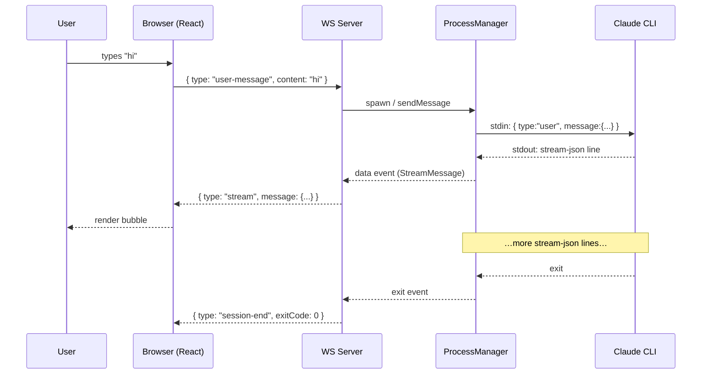

# WebSocket Message Protocol

`@synapse-chat/server` and `@synapse-chat/react` are deliberately **agnostic** about the on-the-wire WebSocket protocol. Apps own their own message shapes — that lets you carry app-specific metadata, multiplex unrelated channels, or even use protobuf if you want.

That said, every embedding app needs *some* concrete protocol, so the framework ships a recommended baseline that the [example app](../apps/example) speaks. Apps that have no special requirements can copy this directly; apps that need more (auth, multi-session, custom commands) can layer on top.

This document describes that baseline. It is also the protocol you should expect when reading the example server / client code.

---

## Conventions

- **Encoding**: UTF-8 JSON, one message per WebSocket frame.
- **Discriminator**: every message has a string `type` field. Unknown types should be ignored, not throw.
- **Direction**: messages are tagged `client → server` or `server → client`.
- **Liveness**: optional `ping` / `pong` frames at the application layer for environments where the WebSocket-level ping is unreliable (e.g. some browser proxies).

---

## Client → Server

### `user-message`

The user submitted text and optionally one or more images.

```ts
interface UserMessage {
  type: "user-message";
  content: string;
  images?: ImageAttachment[];   // base64-encoded, see @synapse-chat/core
}
```

| Field | Type | Notes |
| --- | --- | --- |
| `content` | `string` | Trimmed text. May be empty if `images` is non-empty. |
| `images` | `ImageAttachment[]?` | Up to N images. The receiving side enforces its own size limits. |

### `app:reset`

Tell the server to terminate the current CLI session and start fresh on the next user message.

```ts
interface AppReset {
  type: "app:reset";
}
```

This is an example of a **custom message** (the `app:` prefix is a convention, not a hard rule). Use the same shape for any app-specific control messages: `type: "app:<verb>"` plus a free-form payload.

### `pong`

```ts
interface Pong {
  type: "pong";
}
```

Reply to a server-initiated ping. The example client sends this automatically when it sees `{ type: "ping" }`.

---

## Server → Client

### `stream`

Wraps a single normalized `StreamMessage` from the underlying CLI. This is the only message the chat UI strictly needs.

```ts
interface StreamFrame {
  type: "stream";
  message: StreamMessage;       // from @synapse-chat/core
}
```

`StreamMessage` itself is the canonical shape returned by `CLIAdapter.parseOutput()`. See [`@synapse-chat/core`](../packages/core/src/types.ts) for the full definition; the most common variants are:

| `message.type` | Meaning |
| --- | --- |
| `assistant` | Streamed assistant text. May arrive in many small chunks; UIs can append to the previous bubble or render each frame independently. |
| `user` | Echo of a user submission (helpful when the same socket is shared between multiple browser windows). |
| `tool_use` | The model invoked a tool. `tool` and `toolInput` describe the call. Pair with the matching `tool_result` via `toolUseId`. |
| `tool_result` | Result delivered back to the model. |
| `system` | Free-form system event (status badges, init banners). Apps look at `subtype` / `meta` for routing. |
| `result` | End-of-turn marker (token usage, cost, etc.). |
| `error` | The CLI surfaced an error. |

### `session-end`

The CLI subprocess exited.

```ts
interface SessionEnd {
  type: "session-end";
  exitCode: number | null;       // null when the process was signalled
}
```

After receiving `session-end`, clients should treat the session as finished. The server may decide to spawn a new process on the next `user-message`; clients should not assume they need to re-handshake.

### `error`

The server hit an internal problem unrelated to the CLI stream itself.

```ts
interface ServerError {
  type: "error";
  message: string;
  /** Optional machine-readable code, e.g. "rate-limit", "process-not-found". */
  code?: string;
}
```

### `ping`

```ts
interface Ping {
  type: "ping";
}
```

Sent every ~30 s by the example server. The reference `WSClient` already replies with `{ type: "pong" }` when configured with `pingType: "ping"`.

---

## Sequence: a single user turn



---

## Versioning + extensibility

- Add new message types behind new `type` strings; never repurpose an existing one.
- Use namespaced prefixes (`app:`, `auth:`, `dispatch:`) to avoid colliding with future framework defaults.
- The framework reserves the bare types listed above (`user-message`, `app:reset`, `pong`, `stream`, `session-end`, `error`, `ping`).
- For breaking changes, bump the WebSocket subprotocol (`ws://…/ws?protocol=v2`) and have the client refuse mismatched servers — far less painful than negotiating in-band.
